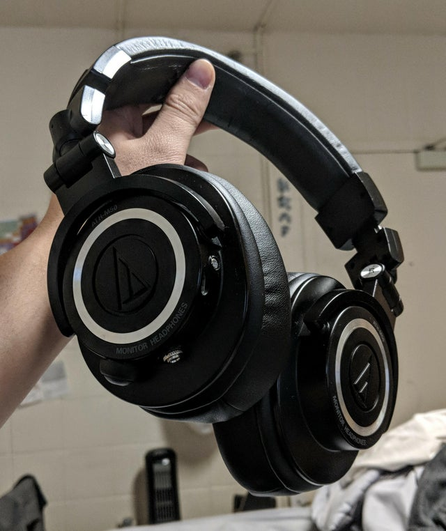
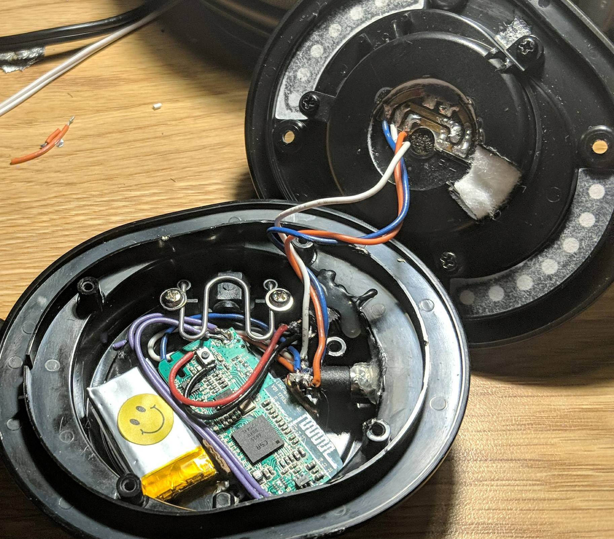
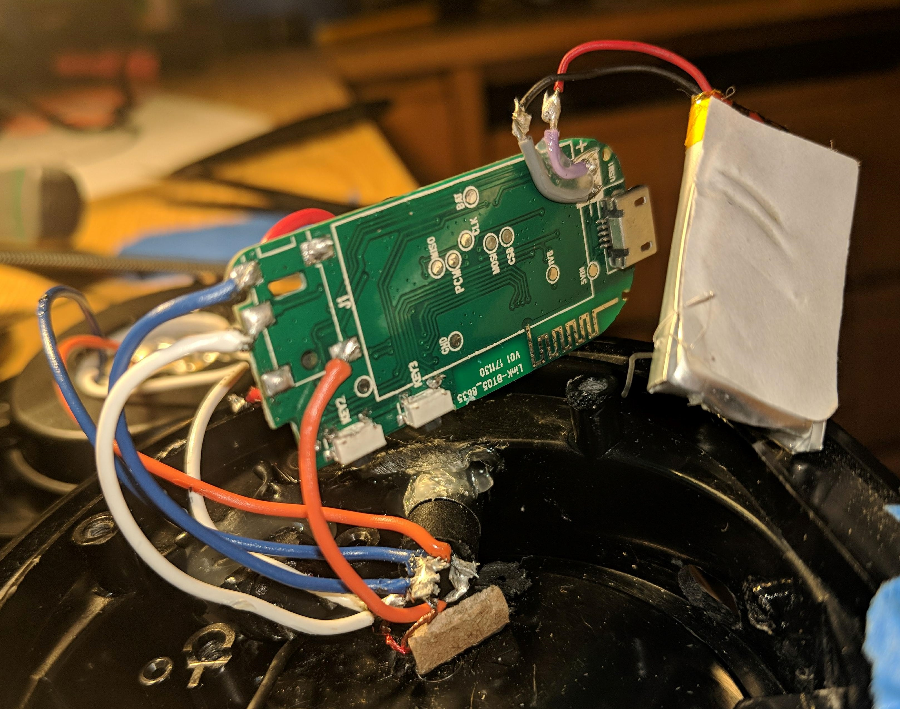
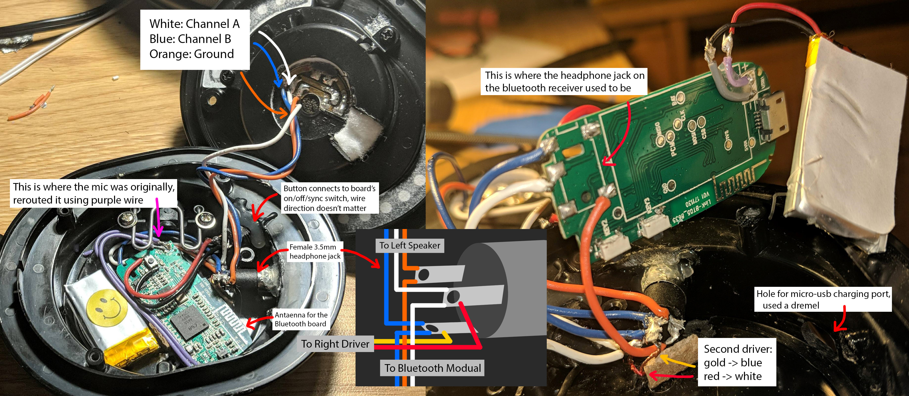

https://www.reddit.com/r/headphones/comments/8eysek/diy_bluetooth_athm50s/

---

I put a Bluetooth receiver into my ATH-M50s and also made the cable removable. Roughly 8 hours of battery and range is pretty good. Honestly can't tell any difference in sound quality other than the signal dropping every now and then.

Also idk if other bluetooth headphones can do this, but if you connect to the headphones and plug the aux to another speaker, it'll make that speaker bluetooth lol

---

Here are the main parts:

Bluetooth receiver - https://www.amazon.com/gp/product/B008AGQMQC/ref=oh_aui_detailpage_o06_s00?ie=UTF8&psc=1

3.5 jack - https://www.amazon.com/gp/product/B01C3RFHDC/ref=oh_aui_detailpage_o06_s01?ie=UTF8&psc=1

side button - https://www.amazon.com/gp/product/B01LYZSEVB/ref=oh_aui_detailpage_o06_s01?ie=UTF8&psc=1

You could probably find cheaper options. I just bought a lot because there wasn't really any tutorials out there on doing this. Other stuff you would need are a soldering iron, a dremel, and some wires, Also, please get better earcups if you haven't already - https://www.amazon.com/gp/product/B00MFDT894/ref=oh_aui_detailpage_o09_s00?ie=UTF8&psc=1

Here are the internals: https://imgur.com/gallery/N91espA