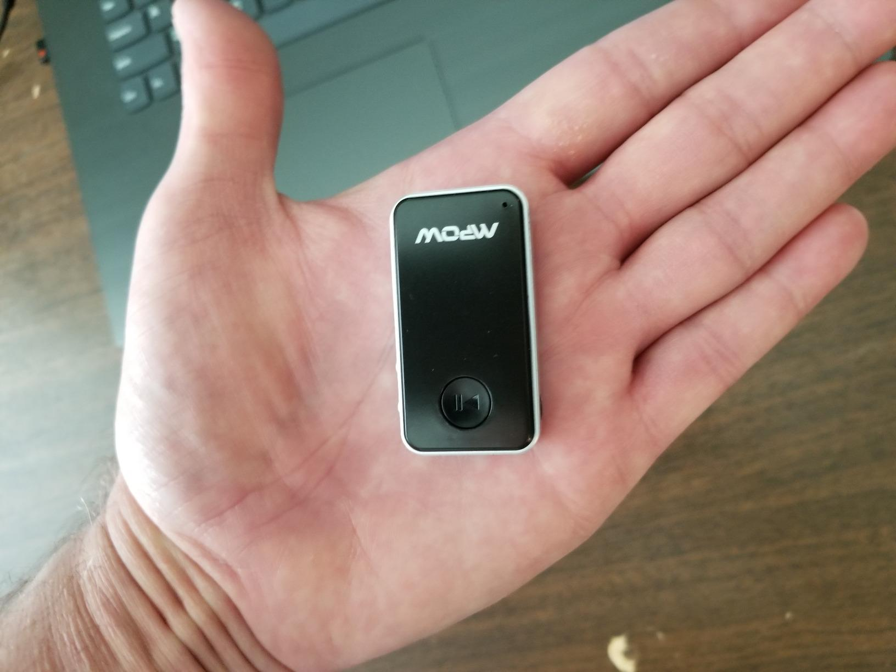
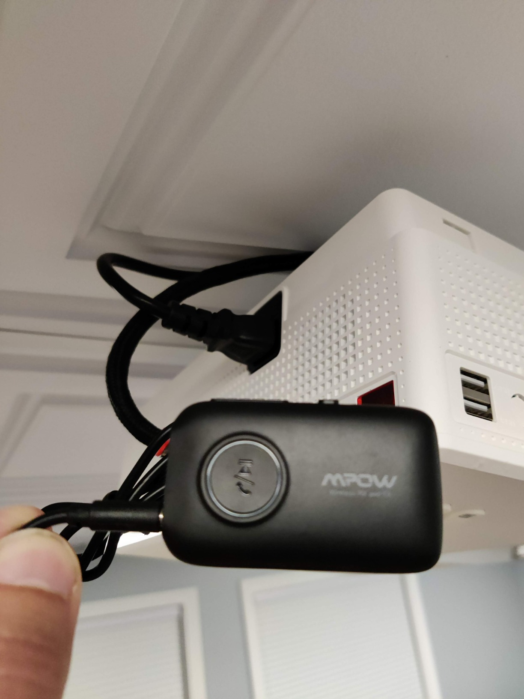
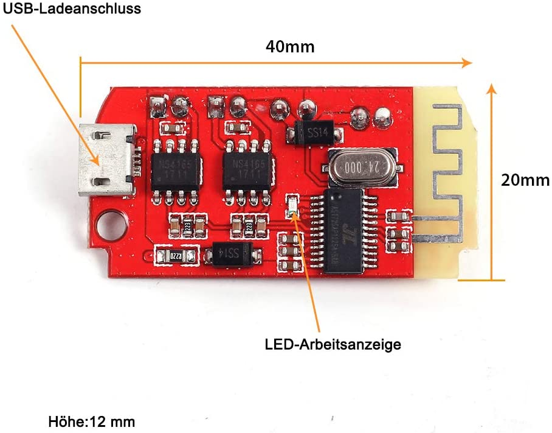
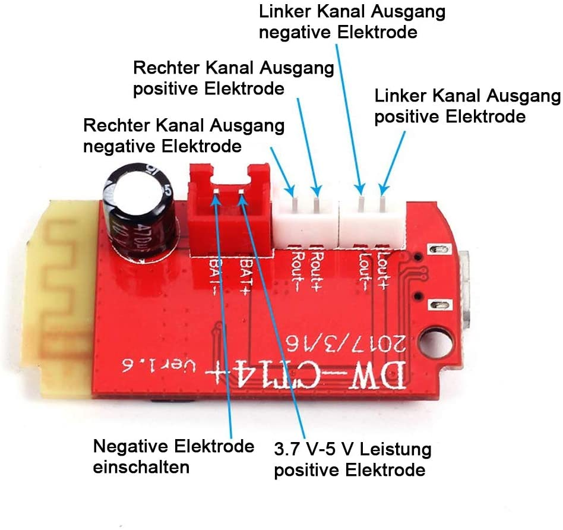
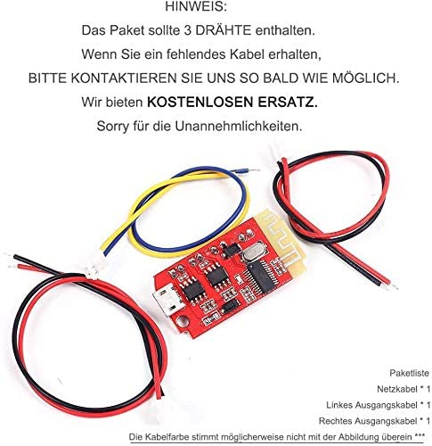
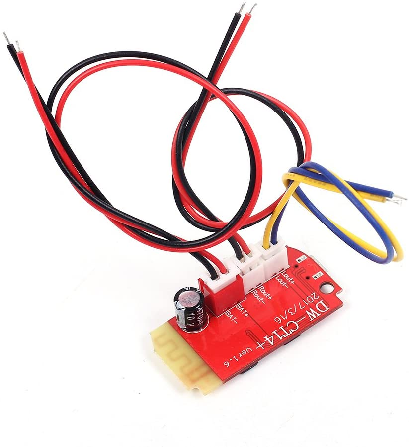
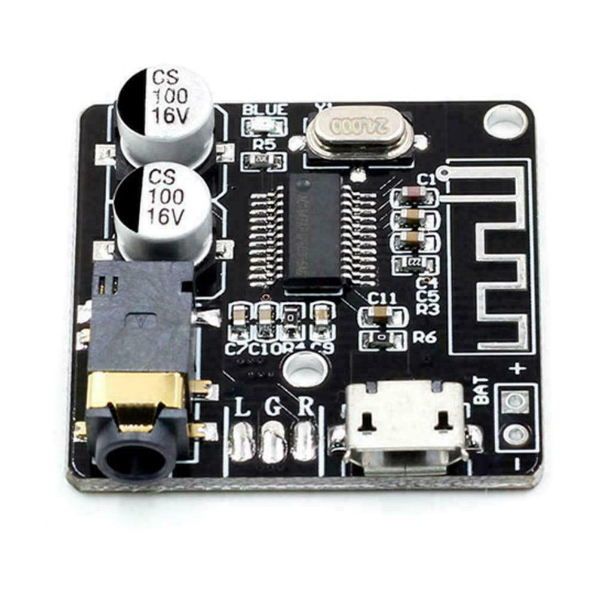
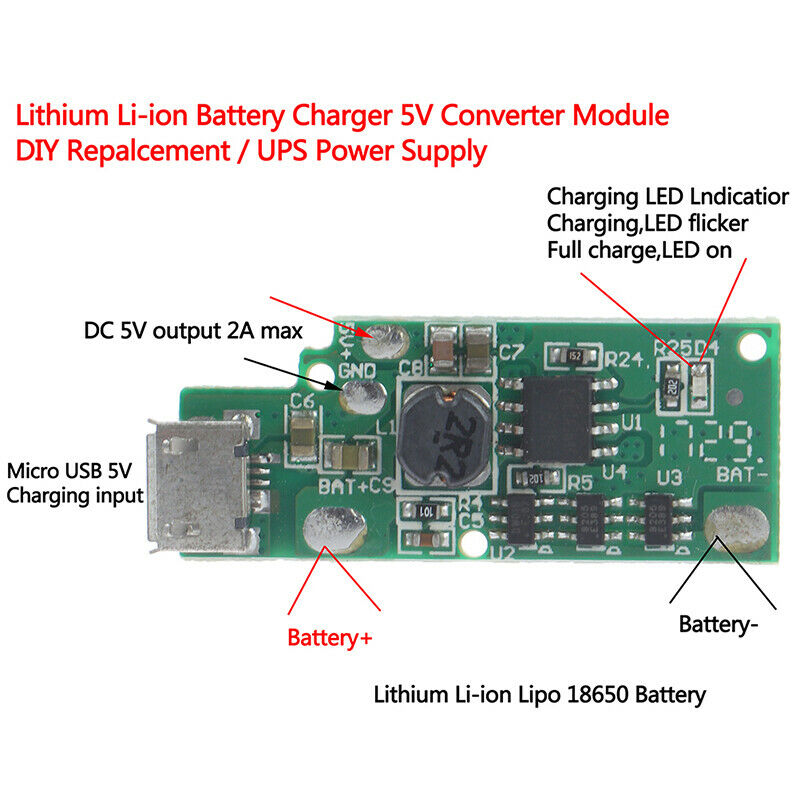
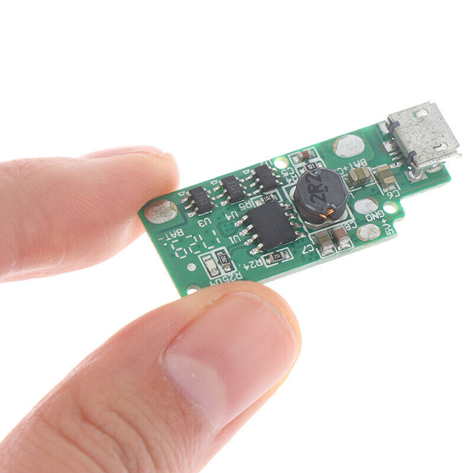
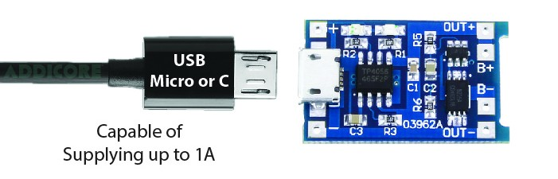

# Bluetooth receiver + DAC + amplifier + battery

## MPOW receivers

Small with included battery

* built in battery
* small form factor
* https://www.xmpow.com/collections/wireless-receiver

### MPOW Bluetooth 4.1 audio receiver

* 10h battery
* [xmpow.com](https://www.xmpow.com/products/mpow-bh044d-bluetooth-receiver)

### MPOW Bluetooth 5.0 aptX audio receiver

* [xmpow.com](https://www.xmpow.com/products/mpow-bh390a-2-in-1-transmitter-receiver-aptx-low-latency-bluetooth-5-0#opinew-plugin)
* [amazon.de](https://www.amazon.de/-/en/gp/product/B07X8VGV3G/ref=ask_ql_qh_dp_hza)
* 15m working range
* **TODO**: What are the dimensions?
  * 5 bis 6cm x 3.5 x 1 bis 1.5 cm (Amazon Q&A)
* [manual](resources/03_Mpow/03_Mpow-Bluetooth-Transmitter-and-Receiver-BH390A-Manual-Optimized.pdf)

## TaoTronics TT-BA07

There are two different versions of this model.

* Bluetooth (VersionA)
  * Bluetooth Version: Bluetooth V4.1 with EDR
  * Bluetooth Profile: A2DP
* Bluetooth (VersionB)
  * Bluetooth Version: Bluetooth V5.0
  * Bluetooth Profile: A2DP / AVRCP
* aptX audio codec
* 4.55 x  3.25 x 0.95 cm
* [pdf (VersonA)](resources/03_TT-BA07/VersionA.pdf)
* [pictures (VersionB)](resources/03_TT-BA07/VersionB/)
* [taotronics.com](https://de.taotronics.com/TT-BA07-Bluetooth-Adapter.html)
* 18€ on [eBay.de](https://www.ebay.de/itm/Bluetooth-Adapter-Audio-Transmitter-Empfanger-2-in-1-Sender-Receiver-Adapter/393199061678?hash=item5b8c7d8aae:g:tEIAAOSwu3FgAGTg)
  * used for ~15€

## TaoTronics TT-BR05

* Bluetooth 4.0 with EDR
* 5.2 x 2.55 x 1.04 cm
* [pdf](resources/03_TaoTronics_TT-BR05.pdf)

## bluetooth receiver and battery charger

* 3.7-5V in via micro-USB
  * Maximum: 5V with 2A
  * 2x 5W audio output
  * Can be used to **charge** a connected 3.7V lithium battery,
    but the battery itself needs a protection board (PCB)!
* 4.0 x 2.0 cm
* bluetooth 5.0
  * device name: DW-CT14+
* [amazon.de](https://www.amazon.de/Bluetooth-Empf%C3%A4ngermodul-Verst%C3%A4rkerplatine-verst%C3%A4rker-drahtlose-Lautsprecher-Rot/dp/B08BJNX7M7/ref=psdc_571838_t2_B07JLC2JMT)
* ebay: Watch out for the **version number**
  * 3.7€: [ebay1](https://www.ebay.de/itm/333672497058?_trkparms=aid%3D1110006%26algo%3DHOMESPLICE.SIM%26ao%3D1%26asc%3D20201210111314%26meid%3D5d0a0e012fd146088e6c235863f19052%26pid%3D101195%26rk%3D5%26rkt%3D12%26mehot%3Dco%26sd%3D153586311236%26itm%3D333672497058%26pmt%3D1%26noa%3D0%26pg%3D2047675%26algv%3DSimplAMLv9PairwiseUnbiasedWeb%26brand%3DUnbranded&_trksid=p2047675.c101195.m1851)
  * 2.14€: [ebay2](https://www.ebay.de/itm/323056335757?hash=item4b37a87b8d:g:K4oAAOSw05taeUIz)

## VHM-314

Bluetooth DAC **without** battery or charging circuit

* 2.22 € on [eBay](https://www.ebay.de/itm/VHM-314-MP3-Bluetooth-5-0-Amplifier-Board-Audio-Lossless-Decoder-Module-D7W1/114446078916?_trkparms=aid%3D1110006%26algo%3DHOMESPLICE.SIM%26ao%3D1%26asc%3D20201210111314%26meid%3D5e96aabe6db643b38e5128ed0fa30430%26pid%3D101195%26rk%3D2%26rkt%3D12%26mehot%3Dco%26sd%3D264942688446%26itm%3D114446078916%26pmt%3D1%26noa%3D0%26pg%3D2047675%26algv%3DSimplAMLv9PairwiseUnbiasedWeb%26brand%3DMarkenlos&_trksid=p2047675.c101195.m1851)
* power in: DC 3.7-5V
* Bluetooth 5.0
* "lossless MP3"
* Decoder Module D7W1
* **small**:  3.3 x 3.5 x 1.1cm

Amazon Reviews:

> Wenn es allerdings nicht über Akku oder Batterie, sondern über ein
> Netzteil betrieben wird, macht es einige Störgeräusche im Standby

> Macht Störgeräusche bei jeder Stille, auch innerhalb eines Tracks.
> Sehr störed, da hilft auch Bluetooth 5.0 mit WAV oder Flac nichts,
> wenn zwischendurch irgendwo Stille ist und die direkt mit nem
> Quietscher eingeläutet wird.

> Tends to overload and distort fairly easily. The loop through is very
> poor with bad distortion.

## lithium-ion battery converter

* power in: 5V (micro-USB)
* power out: 5V 
* 1.66 € on [eBay](https://www.ebay.de/itm/DC5V-Micro-USB-18650-3-7V-Lithium-Li-ion-Battery-Charger-DIY-Module-Power-F0/284209282868?hash=item422c317f34:g:M8UAAOSwr3heUJDZ)
* **small**: 3.5cm x 1.5 cm

## lithium-ion battery charger

* power in: 4.5-6.0V (-> micro-USB 5V)
* power out: (?) 3.7V I guess (straight from the batteries)
* battery protection (overcharge, over-discharge, overcurrent)
* one or two batteries can be connected
* **smaller**: 2.8 x 1.7 cm

* [addicore.com](https://www.addicore.com/TP4056-Charger-and-Protection-Module-p/ad310.htm#resources)
* [eBay](https://www.ebay.de/itm/1-2-5-TP4056-5V-1A-18650-Micro-USB-Lithium-Battery-Charger-Module-Protected/402351347534?hash=item5dae02574e:g:nMEAAOSwSmJfKsgZ)
* [eBay, USB-C](https://www.ebay.de/itm/1-2-5-TP4056-5V-1A-18650-Type-C-USB-Lithium-Battery-Charger-Module-Protected/402353617147?hash=item5dae24f8fb:g:3mQAAOSwHAdfLTa7)

More details in folder [03_TP4056_TC4056A](resources/03_TP4056_TC4056A)

## lithium-ion battery charger

* Uses the TP4056 chip as well.
* A bit smaller in size

* [ebay](https://www.ebay.de/itm/1-x-Micro-USB-5V-1A-LiPo-Lithium-Li-ion-Akku-Batterie-Lade-Modul-DIY-Chip-TP4056/401705655188?hash=item5d8785db94:g:l5cAAOSwH6lcYX9p)

## tiny USB-C LiPo charger

* [crowdsupply.com](https://www.crowdsupply.com/beast-devices/ant2-lipo-charger)
* [hackaday.io](https://hackaday.io/project/176321-ant2-usb-c-lipo-charger)