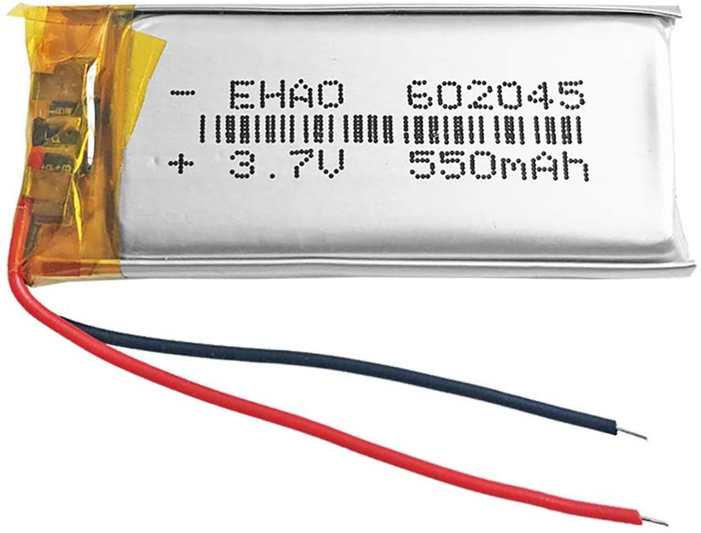
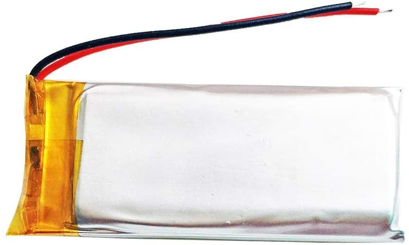
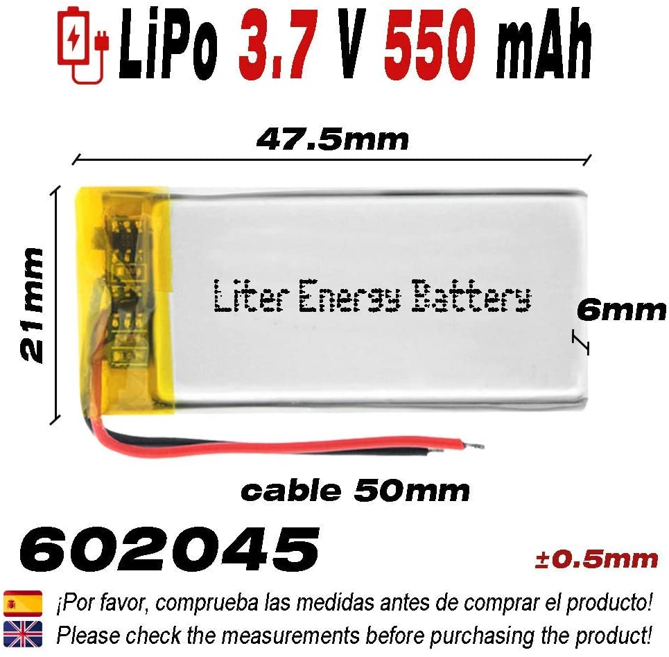
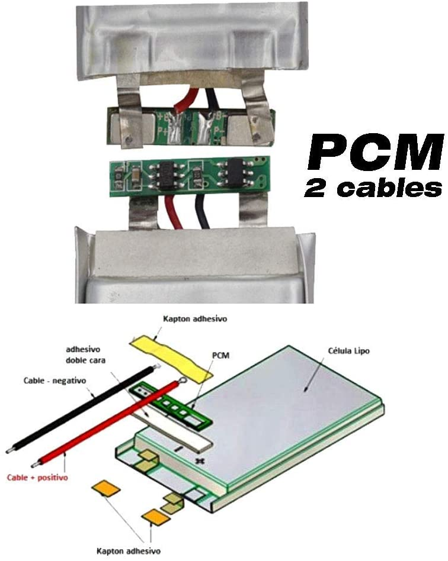
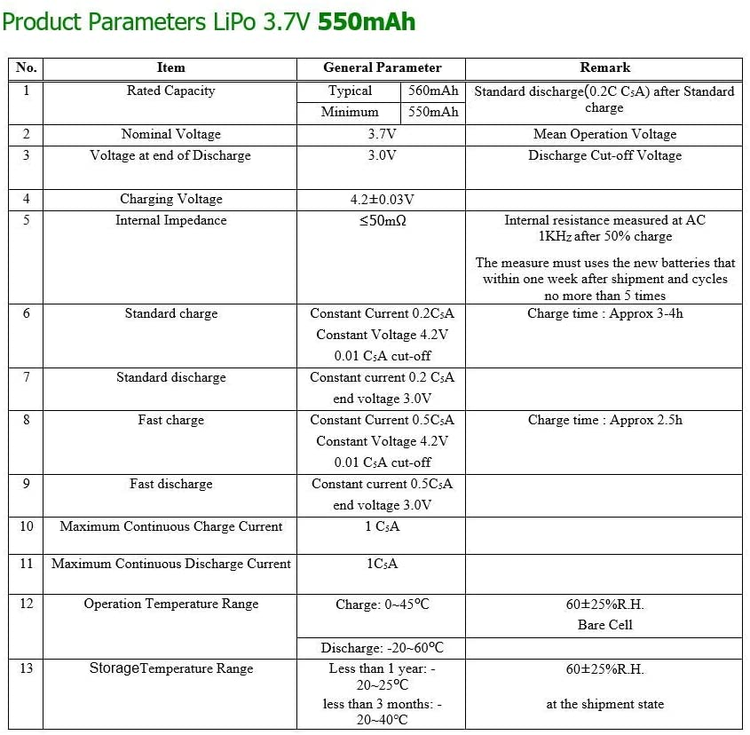
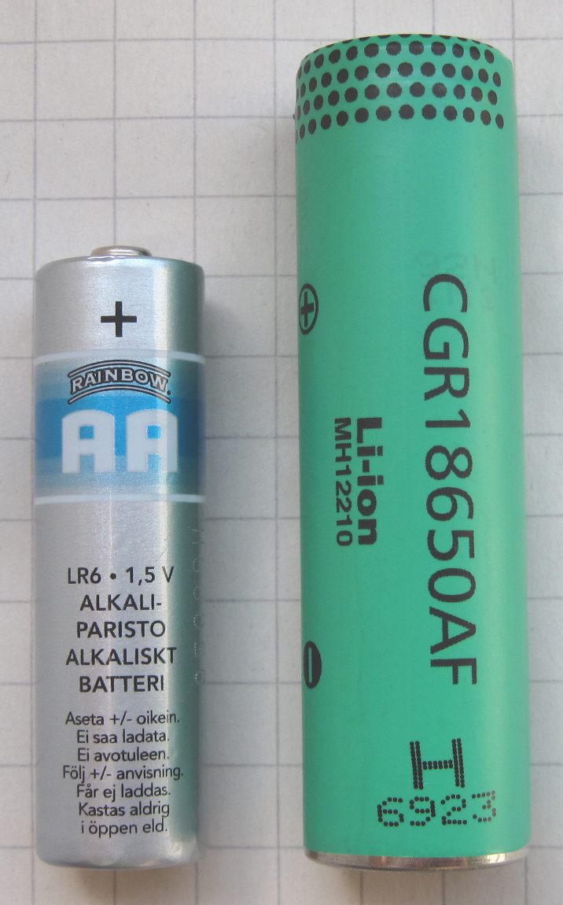
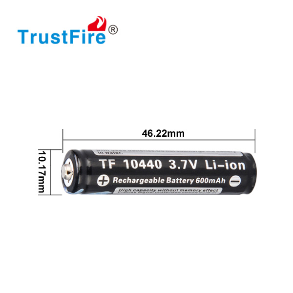

# lithium batteries

## lithium polymer battery (LiPo)

### akkuplus.de

Probably all with PCM (battery protection boards)

* 300mAh, 3.5 x 2.0 x 0.5 cm
  * https://akkuplus.de/Einzelzelle-502035-052035-37-Volt-300mAh-Li-Polymer
* 370mAh, 4.0 x 2.0 x 0.5 cm
  * https://akkuplus.de/Einzelzelle-502040-052040-37-Volt-370mAh-Li-Polymer
* 500mAh, 3.5 x 2.0 x 0.8 cm
  * https://akkuplus.de/Einzelzelle-802035-082035-37-Volt-500mAh-Li-Polymer
* 500mAh, 3.5 x 2.5 x 0.5 cm
  * https://akkuplus.de/Einzelzelle-502535-052535-37-Volt-500mAh-Li-Polymer
* 500mAh, 5.2 x 1.4 x 0.6 cm
  * https://akkuplus.de/Einzelzelle-601452-061452-37-Volt-500mAh-Li-Polymer
* 550mAh, 3.8 x 2.3 x 0.61 cm
  * https://akkuplus.de/Einzelzelle-612338-062338-37-Volt-550mAh-Li-Polymer
* 850mAh, 5.614 x 2.6 x 5.80 cm
  * https://akkuplus.de/Ersatzakku-CS-SRD102SL-Cardo-Packtalk-Duo-BAT00007-37-Volt-850mAh-Li-Polymer

## 602244

* 550mAh
* 4.4 x 2.2 x 0.6 cm (+/- 0.05cm)
* PCM
* https://www.amazon.de/DronePost-Batterie-602244-Wiederaufladbar-Tragbar/dp/B084Z9NGK5/ref=sr_1_2?__mk_de_DE=%C3%85M%C3%85%C5%BD%C3%95%C3%91&dchild=1&keywords=3%2C7v+550mAh&qid=1619259512&sr=8-2

## 602045

* 550mAh
* 4.75 x 2.1 x 0.6 cm (+/- 0.05cm)
* PCM: "Integrierte PCM-Schutzschaltung gegen Überladung oder
  übermäßige Entladung. Schutzfunktion: Überladung, Überentladung,
  Überstrom, Kurzschlussschutz, Übertemperaturschutz."
* https://www.amazon.de/DronePost-Batterie-602045-Wiederaufladbar-Tragbar/dp/B088NL9GSD/ref=sr_1_3?__mk_de_DE=%C3%85M%C3%85%C5%BD%C3%95%C3%91&dchild=1&keywords=3%2C7v+550mAh&qid=1619259512&sr=8-3

## lithium-ion batteries

### 18650 lithium-ion battery

*  1.8 x 7.0 cm

> AA vs 18650 lithium ion battery
> 
> 

#### Keeppower

* 3400mAh (min.), 3.6-3.7V (nominal voltage)
* 14.95€ ( + 4.90€ shipping )
* with protection
* [akkuteile.de](https://www.akkuteile.de/lithium-ionen-akkus/18650/keeppower/pcb-geschuetzt/keeppower-18650-3500mah-li-ionen-3-7v-3-6v-pcb-geschuetzt-mit-usb-lademoeglichkeit-p1835u_12070_2779)

#### Trustfire

* 2050mAh (min.), 3.7V (nominal voltage)
* 5.60€ ( + 4.90€ shipping )
* with protection
* [akkuteile.de](https://www.akkuteile.de/trustfire-18650-2400mah-3-7v-protected_100617_1218)

### 14430 lithium-ion battery

* 1.4 x 4.6 cm

#### Keeppower

* 650mAh (min.), 3.7V (nominal voltage)
* with protection
* 4.95€ ( + 4.90€ shipping )
* [akkuteile.de](https://www.akkuteile.de/lithium-ionen-akkus/14430/keeppower/keeppower-14430-650mah-3-7vli-ion-akku-geschuetzt_12001_1005)

### 10440 lithium-ion battery

* 4.6 x 1.0 cm

#### Trustfire

* 300mAh (min.), 3.6-3.7V (nominal voltage)
* with protection
* 4.45€ ( +4.90€ shipping )
* [akkuteile.de](https://www.akkuteile.de/lithium-ionen-akkus/14500/trustfire/trustfire-10440-600mah-3-7v-geschuetzte-li-ionen-zelle_101106_2165)

