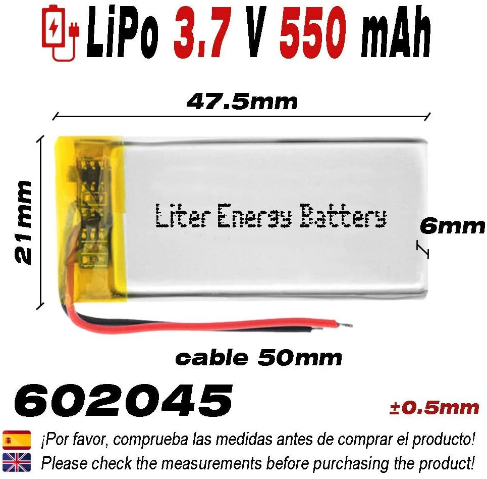

# Audiotechnica ATH-50x - Bluetooth and detachable 3.5mm AUX cable DIY mod

## Inspecting the headphones

1. Remove the left ear pad (headphone cushion),
   and open the left speaker by removing 4 screws.

2. Cable to left driver: Blue is `left` and
   copper is `ground`.

3. Audiotechnica specific audio input (**not** 3.5mm aux) with wiring
   `left`, `ground`, `ground`, `right`.
   One cable is going through 
   the hinge and to the opposite driver.

   There is a white silencing pad which will be
   replaced in favour of our bluetooth receiver.
   

4. There isn't too much space inside the left speaker ...
   The diameter of the ellipse is around 6cm.

5. A circular piece of plastic with another
   silencing pad holds the driver in place.
   If this is removed there is some additional space
   inside the speaker, but the driver would need
   to be glued to stay in place.
   

> Note how the driver is angled.

## What fits inside the speaker?

A 0.9cm diameter piece of rubber for testing ;)

1. If the rubber is placed to the left where the
   driver sticks out most, then one can not
   assemble it together ...

> Note the space between the upper and lower parts.

2. A "dummy" 10440 lithium-ion battery (approx. 
   4.6 long with a diameter of 1.0 cm) held in place
   by a rubber.
   This does obviously **not** fit inside.
   Even if one grinds off the dot in the center of
   the speaker, this does not fit.
   So one needs a low-profile lithium-ion battery
   (similar to those in modern smartphones) to power
   the bluetooth receiver.

3. If the rubber is placed in the (upper/lower) middle
   then one can almost fit it perfectly together.
   It sticks out just a tiny bit.

## The required parts

### DIY 3.5mm AUX whole

### Bluetooth receiver - TaoTronics TT-BA07

Removing the case:

Removing the battery - we'll use a larger one!

---

Power on button removed:

Let's attach some wires:
* The two wires on the left will connect to a power button on the
  outside of the headphone. With this button one can control the bluetooth receiver:
  Turn it on/off, pause/resume music and enable pairing mode.
* Three wires on the right will connect the audio from the bluetooth receiver
  with our DIY 3.5mm aux whole.

### Button

A desoldered button from some old electronics.

The lower and upper left pins are not connected,
when the button is not pressed. Same goes for the lower and upper right pins.

When the button is pressed, all pins are connected to each other.

### ATH-M50x

Let's drill some wholes into the left headphone cup:

* One large whole to recharge the bluetooth receiver:

* Here a micro USB cable is plugged through the whole from outside:

* Four wholes to attach the button on the outside

* On two of the 4 connectors of the button, place large bowls of soldering
  iron - this holds the button in place:

### The battery

### (Optional) Better earpads

Brainwavz Audio - ATH-M Series - Pro Stock - Micro Suede

## The final assembly

Well, before we glue and solder it all together, let's do a listening test!
In the picture below I turned the bluetooth receiver on/off by holding the
two "button" wires together:

The inserted bluetooth receiver is held in place by some hot glue.

Soldering the three red "audio" cables from the bluetooth receiver together
two black cables coming from the left and right drivers (each containing two
cores) onto the 3.5mm aux plug was a bit tricky.
But luckily I had another person helping me out holding all those wires in
place, so I could solder it.

Time for another listening test. This time both headphone drivers and the
earphones plugged into the 3.5mm aux whole should play music - both with
correctly oriented left/right audio.

Now add some more glue to the bluetooth receiver and
aux plug.

Insert the battery, connect it with the power input of the bluetooth receiver
and solder the two "button" wires from the bluetooth receiver to the button
of the headphone cup.

That's pretty much it :) Only steps left are closeing the left headphone cup and reattaching the earpads.

## Final result

